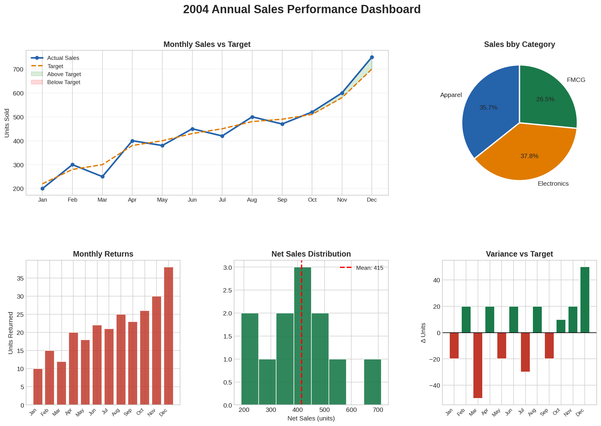

# Sample Sales Dashboard

A standalone Python project that builds a comprehensive, multi-chart data visualization dashboard using `matplotlib` and `pandas`. By utilizing `GridSpec`, the script organizes five distinct analytical visualizations into a single, cohesive reporting layout.

## 📊 Dashboard Overview

This project showcases how to handle custom dataset preparation, feature derivation, and advanced multi-plot layouts in Python. It processes monthly commercial metrics (Sales, Targets, Returns, and Categories) to generate an executive-level performance summary.

### Visual Components Included:
1.  **Sales vs. Target (Line + Shaded Area):** Displays chronological actual performance against set goals with green/red conditional fills indicating monthly surplus or deficit.
2.  **Category Contribution (Pie Chart):** Breaks down the share of total sales across internal product sectors (Electronics, Apparel, FMCG).
3.  **Monthly Returns (Bar Chart):** Tracks monthly product return volume to monitor quality control trends.
4.  **Net Sales Distribution (Histogram):** Plots the density distribution of net sales, complete with an automated mean indicator line.
5.  **Variance vs. Target (Positive/Negative Bar Chart):** Visualizes performance deltas using conditional color schemes (positive performance vs. negative variance).



---


## 🛠️ Tech Stack & Dependencies

*   **Python 3.x**
*   **pandas** - Data frame creation, aggregation groupings, and derived column calculations.
*   **numpy** - Numerical calculations and baseline array operations.
*   **matplotlib** - Subplot construction, styling templates, and core geometric rendering via `gridspec`.

To install the required environment packages:
```bash
pip install pandas numpy matplotlib
